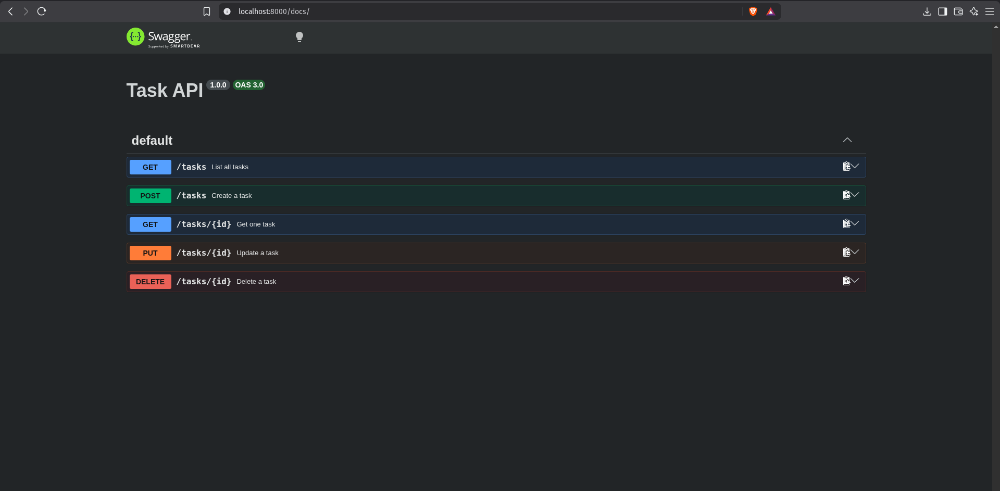

# Task API

A simple CRUD API for managing a to-do list, built with Node.js and Express.

## How to run

1. Clone this repo
2. Run `npm install`
3. Run `npm start`
4. Server runs at [http://localhost:3000](http://localhost:3000)

## Endpoints

| Method | Path | Description |
|---|---|---|
| GET | `/tasks` | List all tasks |
| GET | `/tasks/:id` | Get one task |
| POST | `/tasks` | Create a task |
| PUT | `/tasks/:id` | Update a task |
| DELETE | `/tasks/:id` | Delete a task |

## Example request

```bash
curl -i -X POST http://localhost:3000/tasks \
-H "Content-Type: application/json" \
-d '{"title":"Buy milk"}'


## Example response
HTTP/1.1 201 Created
Content-Type: application/json


{
  "id": 4,
  "title": "Buy milk",
  "done": false
}
Swagger UI

Visit http://localhost:8000/docs for interactive API documentation.




# ASSignment 2
## Database

This project uses SQLite instead of an in-memory array, so data survives server restarts.

**Why SQLite:**  
Zero setup, no separate server to install, and the whole database is stored in one file (`tasks.db`). The database is created automatically the first time the app runs.

**Where it lives:**  
`tasks.db` is created in the project root. It is git-ignored, so each clone starts with a fresh database that is automatically created and seeded with 3 example tasks on the first run.

**Example query I ran in DB Browser:**

```sql
SELECT * FROM tasks WHERE done = 1;


## Assignment 3 dockerize your app
## Containerized Stack

This project runs in Docker with `docker compose up` — no manual setup needed.

**Run it:**
1. Copy `.env.example` to `.env`
2. Run `docker compose up`
3. API is available at http://localhost:3000

**Architecture note:** SQLite storage is isolated inside `repositories/taskRepository.js`. 
When containerizing the app, the service layer (`services/taskService.js`) and all routes 
in `index.js` were not modified — only the repository and `db/` files changed. This proves 
the repository pattern isolates storage from business logic.

**Persistence proof:** Created a task via POST, ran `docker compose down` then `docker compose up` 
again, and confirmed via `GET /tasks` that the task still existed — the named volume (`taskdata`) 
kept the SQLite file alive across a full container teardown and rebuild.

# Auth & Protect API

A secure RESTful API built with Node.js, Express, and Supabase Auth. This project handles user authentication (Sign Up, Log In, Log Out) and protects specific API endpoints using JWT Bearer Token verification.

##  Features

- **User Authentication:** Sign up and log in via Supabase Auth.
- **Route Protection:** Custom Express middleware (`requireAuth`) verifies JWTs.
- **API Documentation:** Interactive Swagger UI documentation with Bearer Token authorization support.

---
